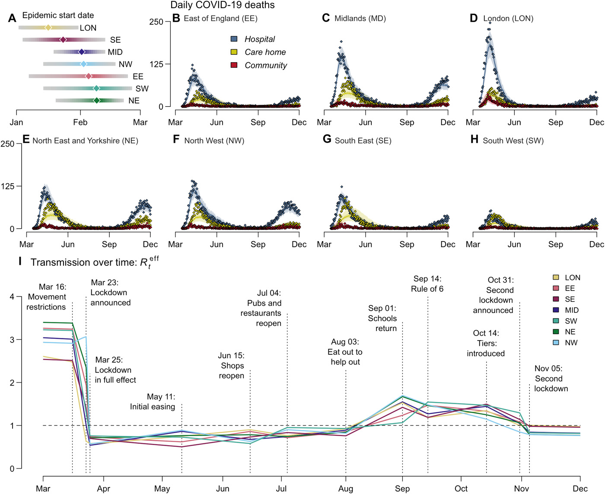
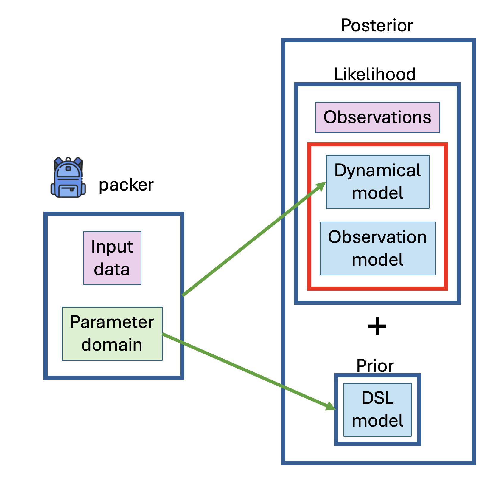
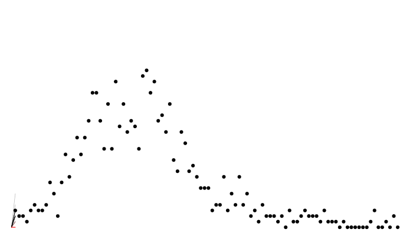
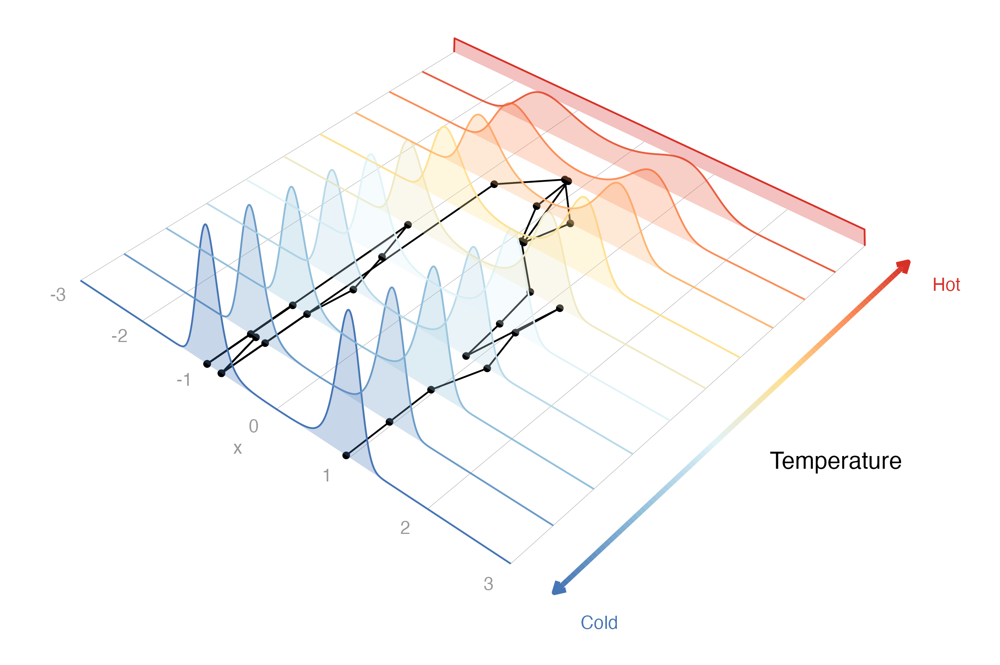

```{r}
#| include: false
#| cache: false
set.seed(1)
source("common.R")
options(monty.progress = FALSE)
```

## odin - the beginnings (2016-2019)

-   **`odin`** created to integrate ODEs (e.g. for compartmental models) in R with a domain-specific language (DSL)
-   Limited support for difference (discrete-time) equations
-   Automatic translation to C/C++/JavaScript; efficient solutions in little code
-   Used in models of malaria, HIV, ebola and other diseases
-   No support for inference

## 😷 COVID-19 response (2020-2022)

::: {style="text-align:center"}
{width=60%}
:::

## 😷 COVID-19 response (2020-2022)

- **`mcstate`** for statistical machinery (particle filter, pMCMC)
- **`dust`** for efficient parallel simulation
- **`odin.dust`** compile `odin` code to use `dust`
- Collaborative work by the UK real-time modelling & research software engineers teams at Imperial College
- Many, many, rough edges


## New software

- Design of a new architecture, rewiring data, model and parameters
- New statistical interface, **`monty`**
  - A new small BUGS-inspired DSL for priors
  - Works well with `odin` models, but usable on its own
  - Modular, and eventually easy to extend
  - Fully replaces `mcstate`
  - inverts the dependency stack

## Key components

::::: columns
::: {.column width="60%"}

:::

::: {.column width="40%"}
-   `monty` models can be built from
    -   `odin` and data
    -   custom DSL
    -   by composition
-   Range of samplers available
-   Concept of "packer"
:::
:::::

## An odin-monty demo

We will show:

-   how to use `odin2` to write and compile some simple models
-   how to use `dust2` to simulate from these
-   how to use `monty` to fit these to data


## The data

We have some data on the daily incidence of cases

```{r}
data <- read.csv("data/incidence.csv")
head(data)
```

## The data

```{r}
plot(data, pch = 19, col = "red")
```

## `odin`

```{r}
library(odin2)
library(dust2)
library(monty)
```

## ODE models

:::: {.columns}

::: {.column width="65%"}

```{r}
#| echo: false
#| results: "asis"
r_output(readLines("models/sir-basic-ode.R"))
```

:::

::: {.column width="35%"}
\begin{gather*}
\frac{dS}{dt} = -\beta S \frac{I}{N}\\
\frac{dI}{dt} = \beta S \frac{I}{N} - \gamma I\\
\frac{dR}{dt} = \gamma I
\end{gather*}
:::

::::

. . .

Things to note:

* out of order definition
* every variable has `initial` and `deriv` pair


## Compiling the model with `odin2`

```{r}
#| echo: false
#| results: "asis"
r_output(model_compile_code("sir_ode", "models/sir-basic-ode.R"))
```

```{r}
#| include: false
sir_ode <- odin("models/sir-basic-ode.R")
```

::: {.notes}
The `odin` call generates C code, compiles it with `gcc` or `clang` to create a shared library, and loads that plus support code into R to create a generator object `gen`
:::

## Running the model with `dust2`

```{r}
sys <- dust_system_create(sir_ode, pars = list())
dust_system_set_state_initial(sys)
t <- seq(0, 100)
y <- dust_system_simulate(sys, t)
```

The output has dimensions number of states x number of timepoints
```{r}
dim(y)
```

## Unpacking states

Output can be nicely unpacked into the different states using `dust_unpack_state`

```{r}
y <- dust_unpack_state(sys, y)

plot(t, y$I, type = "l", xlab = "Time", ylab = "I")
```

::: {.notes}
From the generator object `gen` we can construct a model (`mod`), here using no parameters -- just using default parameters as defined above. We run over a set of times and output the value of the system at a number of intermediate times.
:::


## Stochastic models

:::: {.columns}

::: {.column width="50%"}

```{r}
#| echo: false
#| results: "asis"
r_output(readLines("models/sir-basic.R"))
```

:::

::: {.column width="50%"}
\begin{gather*}
S(t + dt) = S(t) - n_{SI}\\
I(t + dt) = I(t) + n_{SI} - n_{IR}\\
R(t + dt) = R(t) + n_{IR}
\end{gather*}

:::

::::

. . .

* `dt` is a special parameter
* every variable has `initial` and `update` pair


## ...compared with ODE models

:::: {.columns}

::: {.column style="font-size: 75%"}
```{r}
#| echo: false
#| results: "asis"
r_output(readLines("models/sir-basic.R"))
```
:::

::: {.column style="font-size: 60%"}
```{r}
#| echo: false
#| results: "asis"
r_output(readLines("models/sir-basic-ode.R"))
```

:::

::::


## Compiling with `odin2`

```{r}
#| echo: false
#| results: "asis"
r_output(model_compile_code("sir", "models/sir-basic.R"))
```

```{r}
#| include: false
sir <- odin("models/sir-basic.R")
```


## Running a single simulation

```{r}
sys <- dust_system_create(sir, pars = list(), dt = 0.25)
dust_system_set_state_initial(sys)
t <- seq(0, 100)
y <- dust_system_simulate(sys, t)
y <- dust_unpack_state(sys, y)

plot(t, y$I, type = "l", xlab = "Time", ylab = "Infected population")
```


## Running multiple simulations

```{r}
sys <- dust_system_create(sir, pars = list(), n_particles = 50,
                                 dt = 0.25)
dust_system_set_state_initial(sys)
t <- seq(0, 100)
y <- dust_system_simulate(sys, t)
y <- dust_unpack_state(sys, y)
matplot(t, t(y$I), type = "l", lty = 1, col = "#00000044",
        xlab = "Time", ylab = "Infected population")
```


## Calculating incidence with `zero_every`

```{r}
#| echo: false
#| results: "asis"
r_output(model_compile_code("sir", "models/sir-incidence.R"))
```

```{r}
#| include: false
sir <- odin("models/sir-incidence.R")
```


## Incidence accumulates then resets

```{r}
sys <- dust_system_create(sir, pars = list(), dt = 1 / 128)
dust_system_set_state_initial(sys)
t <- seq(0, 20, by = 1 / 128)
y <- dust_system_simulate(sys, t)
y <- dust_unpack_state(sys, y)

plot(t[t %% 1 == 0], y$incidence[t %% 1 == 0], type = "o", pch = 19,
     ylab = "Infection incidence", xlab = "Time")
lines(t, y$incidence, col = "red")
```


## Time-varying inputs: using `time`

```{r}
#| echo: false
#| results: "asis"
r_output(model_compile_code("sir", "models/sir-time.R"))
```

```{r}
#| include: false
sir <- odin("models/sir-time.R")
```


## Time-varying inputs: using `interpolate`

The `interpolate` function in odin can be used for time-varying parameters, with specification of

- the times of changepoints
- the values at those changepoints
- the type of interpolation: linear, constant or spline


## Time-varying inputs: using `interpolate`

```{r}
#| echo: false
#| results: "asis"
r_output(model_compile_code("sir", "models/sir-interpolate-constant.R"))
```

```{r}
#| include: false
sir <- odin("models/sir-interpolate-constant.R")
```


## Using arrays: model with age and vaccine

```{r}
#| echo: false
#| results: "asis"
r_output(model_compile_code("sir_age_vax", "models/sir-age-vax.R"))
```

## Key features of arrays

- All arrays (whether state variable or parameter) need a `dim` equation
- No use of `i`, `j` etc on LHS - indexing on the LHS is implicit
- Support for up to 8 dimensions, with index variables `i`, `j`, `k`, `l`, `i5`, `i6`, `i7`, `i8`
- Functions for reducing arrays such as `sum`, `prod`, `min`, `max` - can be applied over entire array or slices


## Fitting `odin` models with `monty`

We return to our data on the daily incidence of cases

```{r}
data <- read.csv("data/incidence.csv")
head(data)
```

## The data {.smaller}

```{r}
plot(data, pch = 19, col = "red")
```

## Our model {.smaller}

Let's fit these data to our model

```{r}
#| echo: false
#| results: "asis"
r_output(model_compile_code("sir", "models/sir-incidence.R"))
```

We will link `cases` in the data to `incidence` in the model, and we will treat
`beta` and `gamma` as unknown parameters to be estimated


## Adding likelihood to the model {.smaller}

```{r}
#| echo: false
#| results: "asis"
r_output(model_compile_code("sir", "models/sir-compare.R"))
```

```{r}
#| include: false
set.seed(1)
sir <- odin("models/sir-compare.R")
```

## Calculating likelihood: particle filtering {.smaller}



## Calculating likelihood {.smaller}

```{r}
filter <- dust_filter_create(sir, data = data, time_start = 0,
                             n_particles = 200, dt = 0.25)
dust_likelihood_run(filter, list(beta = 0.4, gamma = 0.2))
```

. . .

The system runs stochastically, and the likelihood is different each time:

```{r}
dust_likelihood_run(filter, list(beta = 0.4, gamma = 0.2))
dust_likelihood_run(filter, list(beta = 0.4, gamma = 0.2))
```

## Filtered trajectories {.smaller}

```{r}
dust_likelihood_run(filter, list(beta = 0.4, gamma = 0.2),
                    save_trajectories = TRUE)
y <- dust_likelihood_last_trajectories(filter)
y <- dust_unpack_state(filter, y)
matplot(data$time, t(y$incidence), type = "l", col = "#00000044", lty = 1,
        xlab = "Time", ylab = "Incidence")
points(data, pch = 19, col = "red")
```


# Particle MCMC {.smaller}

So we have a marginal likelihood estimator from our particle filter

. . .

How do we sample from `beta` and `gamma`?

. . .

We need:

* to tidy up our parameters
* to create a prior
* to create a posterior
* to create a sampler

## "Parameters" {.smaller}

* Our filter takes a **list** of `beta` and `gamma`, `pars`
  - it could take all sorts of other things, not all of which are to be estimated
  - some of the inputs might be vectors or matrices
* Our MCMC takes an **unstructured vector** $\theta$
  - we propose a new $\theta^*$ via some kernel, say a multivariate normal requiring a matrix of parameters corresponding to $\theta$
  - we need a prior over $\theta$, but not necessarily every element of `pars`
* Smoothing this over is a massive nuisance
  - some way of mapping from $\theta$ to `pars` (and back again)

## Parameter packers {.smaller}

Our solution, "packers"

```{r}
packer <- monty_packer(c("beta", "gamma"), fixed = list(I0 = 10))
packer
```

. . .

We can transform from $\theta$ to a named list:

```{r}
packer$unpack(c(0.2, 0.1))
```

. . .

and back the other way:

```{r}
packer$pack(c(beta = 0.2, gamma = 0.1, I0 = 10))
```


## Priors {.smaller}

Another DSL, similar to odin's:

```{r}
prior <- monty_dsl({
  beta ~ Exponential(mean = 0.5)
  gamma ~ Exponential(mean = 0.3)
})
```

. . .

This is a "monty model"

```{r}
prior
monty_model_density(prior, c(0.2, 0.1))
```

## From a dust filter to a monty model {.smaller}

```{r}
filter
```

. . .

Combine a filter and a packer

```{r}
packer <- monty_packer(c("beta", "gamma"))
likelihood <- dust_likelihood_monty(filter, packer, save_trajectories = TRUE)
likelihood
```

Here we specify `save_trajectories = TRUE` to output the state trajectories at even collected sample.

## Posterior from likelihood and prior {.smaller}

Combine a likelihood and a prior to make a posterior

$$
\underbrace{\Pr(\theta | \mathrm{data})}_{\mathrm{posterior}} \propto \underbrace{\Pr(\mathrm{data} | \theta)}_\mathrm{likelihood} \times \underbrace{P(\theta)}_{\mathrm{prior}}
$$

. . .

```{r}
posterior <- likelihood + prior
posterior
```

(remember that addition is multiplication on a log scale)

## Create a sampler

A diagonal variance-covariance matrix (uncorrelated parameters)

```{r}
vcv <- diag(2) * 0.2
vcv
```

Use this to create a "random walk" sampler:

```{r}
sampler <- monty_sampler_random_walk(vcv)
sampler
```

## Let's sample!

```{r, cache = TRUE}
samples <- monty_sample(posterior, sampler, 1000, n_chains = 3)
samples
```

## The result: diagnostics

Diagnostics can be used from the `posterior` package

```{r}
## Note: as_draws_df converts samples$pars, and drops anything else in samples
samples_df <- posterior::as_draws_df(samples)
posterior::summarise_draws(samples_df)
```

## The results: parameters

You can use the `posterior` package in conjunction with `bayesplot` (and then also `ggplot2`)

```{r}
bayesplot::mcmc_scatter(samples_df)
```

## The result: traceplots

```{r}
bayesplot::mcmc_trace(samples_df)
```

## The result: density over time

```{r}
matplot(drop(samples$density), type = "l", lty = 1)
```

## The result: density over time

```{r}
matplot(drop(samples$density[-(1:100), ]), type = "l", lty = 1)
```

## Better mixing {.smaller}

```{r, cache = TRUE}
vcv <- matrix(c(0.01, 0.005, 0.005, 0.005), 2, 2)
sampler <- monty_sampler_random_walk(vcv)
samples <- monty_sample(posterior, sampler, 2000, initial = samples,
                        n_chains = 4)
matplot(samples$density, type = "l", lty = 1)
```

## Better mixing: the results

```{r}
samples_df <- posterior::as_draws_df(samples)
posterior::summarise_draws(samples_df)
```

## Better mixing: the results

```{r}
bayesplot::mcmc_scatter(samples_df)
```

## Better mixing: the results

```{r}
bayesplot::mcmc_trace(samples_df)
```


## Trajectories

```{r}
trajectories <- dust_unpack_state(filter,
                                  samples$observations$trajectories)
matplot(data$time, trajectories$incidence[, , 1], type = "l", lty = 1,
        col = "#00000044", xlab = "Time", ylab = "Infection incidence")
points(data, pch = 19, col = "red")
```

## Trajectories

Trajectories are 4-dimensional

```{r}
# (4 states x 20 time points x 1000 samples x 4 chains)
dim(samples$observations$trajectories)
```

These can get very large quickly - there are two main ways to help reduce this:

* Saving only a subset of the states
* Thinning (can be done while running or after running)

```{r}
samples <- monty_samples_thin(samples, burnin = 500, thinning_factor = 2)
```


## Pipeline summary
* Write model including likelihood and compile with `odin2`
* Build filter and monty likelihood object with `dust2`
* Create packer with `monty`
* Create prior with `monty` DSL
* Combine prior and likelihood models
* Create sampler
* Run sampler with `monty_sample`


## Deterministic models from stochastic

* Stochastic models written in odin, can be run deterministically
* Runs by taking the expectation of any random draws
* This gives two models for the price of one
* However it might not be suitable for all models

## Fitting in deterministic mode

The key difference is to use `dust_unfilter_create`

```{r}
unfilter <- dust_unfilter_create(sir, data = data, time_start = 0, dt = 0.25)
```

Note as this is deterministic it produces the same likelihood every time

```{r}
dust_likelihood_run(unfilter, list(beta = 0.4, gamma = 0.2))
dust_likelihood_run(unfilter, list(beta = 0.4, gamma = 0.2))
```

## Fitting in deterministic mode

```{r}
#| include: false
set.seed(1)
```

```{r}
likelihood <- dust_likelihood_monty(unfilter, packer, save_trajectories = TRUE)
posterior <- likelihood + prior
samples_det <- monty_sample(posterior, sampler, 1000, n_chains = 4)
samples_det <- monty_samples_thin(samples_det,
                                  burnin = 500,
                                  thinning_factor = 2)
```

## Stochastic v deterministic comparison

```{r}
y <- dust2::dust_unpack_state(filter, samples$observations$trajectories)
incidence <- array(y$incidence, c(20, 1000))
matplot(data$time, incidence, type = "l", lty = 1, col = "#00000044",
        xlab = "Time", ylab = "Infection incidence", ylim = c(0, 75))
points(data, pch = 19, col = "red")

```

## Stochastic v deterministic comparison

```{r}
y <- dust2::dust_unpack_state(filter, samples_det$observations$trajectories)
incidence <- array(y$incidence, c(20, 1000))
matplot(data$time, incidence, type = "l", lty = 1, col = "#00000044",
        xlab = "Time", ylab = "Infection incidence", ylim = c(0, 75))
points(data, pch = 19, col = "red")

```

## Stochastic v deterministic comparison

```{r}
pars_stochastic <- array(samples$pars, c(2, 500))
pars_deterministic <- array(samples_det$pars, c(2, 500))
plot(pars_stochastic[1, ], pars_stochastic[2, ], ylab = "gamma", xlab = "beta",
     pch = 19, col = "blue")
points(pars_deterministic[1, ], pars_deterministic[2, ], pch = 19, col = "red")
legend("bottomright", c("stochastic fit", "deterministic fit"), pch = c(19, 19), 
       col = c("blue", "red"))
```

## Projections and counterfactuals

* Save the final state at every sample (for onward simulation)
* Save snapshots at intermediate timepoints of the state at every sample (for counterfactuals)

Example implementation of both of these can be found [here](https://mrc-ide.github.io/odin-monty/counterfactuals.html)

## Parallelism

Two places to parallelise

* among particles in your filter
* between chains in the sample

e.g., 4 threads per filter x 2 workers = 8 total cores in use

These are both straightforward to setup, a demonstration can be found [here](https://mrc-ide.github.io/odin-monty/parallel.html)


## Advanced `monty`: parallel tempering

Motivating example: likelihood is a mixture of normals model

```{r}
#| include: false
set.seed(1)
```

```{r}
ex_mixture <- function(x) log(dnorm(x, mean = 5) / 2 + dnorm(x, mean = -5) / 2)
likelihood <- monty_model_function(ex_mixture, allow_multiple_parameters = TRUE)
```

prior is a normal distribution with a wider variance

```{r}
prior <- monty_dsl({
  x ~ Normal(0, 10)
})
```

## Advanced `monty`: parallel tempering

posterior is the product of the two (the sum on a log-scale)

```{r}
posterior <- likelihood + prior
x <- seq(-10, 10, length.out = 1001)
y <- exp(posterior$density(rbind(x)))
plot(x, y / sum(y) / diff(x)[[1]], col = "red", type = 'l', ylab = "density")
```

## Advanced `monty`: parallel tempering

Try a random walk Metropolis-Hastings sampler for this model

```{r}
vcv <- matrix(1.5)
sampler_rw <- monty_sampler_random_walk(vcv = vcv)
res_rw <- monty_sample(posterior, sampler_rw, n_steps = 1000)
```

## Advanced `monty`: parallel tempering

Only one mode has been explored

```{r}
plot(res_rw$pars[1, , ], ylim = c(-8, 8), ylab = "Value")
abline(h = c(-5, 5), lty = 3, col = "red")
```

## Advanced `monty`: parallel tempering

Multiple chains does not solve the issue

```{r}
res_rw3 <- monty_sample(posterior, sampler_rw, n_steps = 1000, n_chains = 3,
                        initial = rbind(c(-5, 0, 5)))
matplot(res_rw3$pars[1, , ], type = "p", pch = 21, ylim = c(-8, 8),
        ylab = "Value", col = c("blue", "green", "purple"))
abline(h = c(-5, 5), lty = 3, col = "red")
```

## Advanced `monty`: parallel tempering

Parallel tempering helps solve such problems

- Multiple chains run at different “temperatures”
- states of the chains can be swapped periodically



## Advanced `monty`: parallel tempering

Use our RW sampler within the parallel tempering sampler

```{r}
vcv <- matrix(1.5)
sampler_rw <- monty_sampler_random_walk(vcv = vcv)
s <- monty_sampler_parallel_tempering(sampler_rw, n_rungs = 10)
res_pt <- monty_sample(posterior, s, 1000, n_chains = 1)
```

## Advanced `monty`: parallel tempering

Parallel tempering helps us explore both modes

```{r}
plot(res_pt$pars[1, , ], ylim = c(-8, 8), ylab = "Value")
abline(h = c(-5, 5), lty = 3, col = "red")
```

## Other `monty` samplers

- Adaptive random walk Metropolis-Hastings
    - model must be deterministic
- Hamiltonian Monte Carlo 
    - model must be differentiable, odin models not supported
- Build your own sampler
    - `monty` will handle bookkeeping and parallelism

## Future roadmap {.smaller}

- NUTS (No U-Turn Sampler) algorithm
- `monty` support for augmented data
- nested sampler for nested models
    - fitting multiple regions together
    - some parameters are regional, some shared
    - regions independent given shared parameters 
    - alternate between updates of the regional parameters (can be done independently) and shared parameters (must be done jointly)
    
## Acknowledgements

- Rich Fitzjohn
- Marc Baguelin

## Resources {.smaller}

-   You can find more in our online `odin` & `monty` book: [https://mrc-ide.github.io/odin-monty/](https://mrc-ide.github.io/odin-monty/)
-   Users of the old versions of the packages may find the migration documentation useful:
    - `odin` to `odin2`: [https://mrc-ide.github.io/odin2/articles/migrating.html](https://mrc-ide.github.io/odin2/articles/migrating.html)
    - `dust` to `dust2`: [https://mrc-ide.github.io/dust2/articles/migrating.html](https://mrc-ide.github.io/dust2/articles/migrating.html)
    - `mcstate` to `monty`: [https://mrc-ide.github.io/monty/articles/migration.html](https://mrc-ide.github.io/monty/articles/migration.html)
